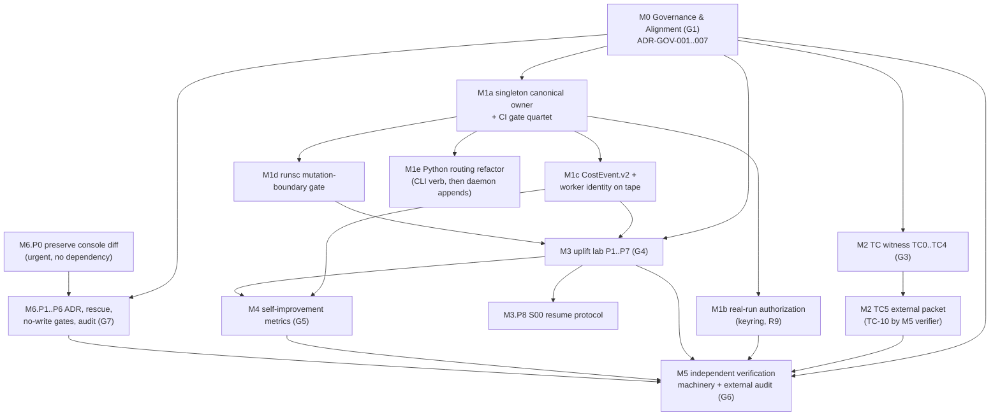

# 02 — Execution Playbook: TuringOS AGI-Substrate Convergence Program

- Version: 1.0.0 (2026-07-02)
- Audience: a Fable-5-class orchestrator agent executing this program autonomously over hours to days, with zero chat context. Everything you need to start is in this file plus the files it points to. All paths are absolute.
- Authority: this playbook is subordinate to `/home/zephryj/turingos_backup/work/PROJECT_PLAN_TURINGOS_AGI_SUBSTRATE_20260702/01_PROJECT_INTENT.md` (the binding intent anchor), which is subordinate to the constitution at `/home/zephryj/turingos_backup/work/turing_v5/pack_v5_3_1/00_authority/constitution_root_law.md` (sha256 `a0174ef8a2be6914f86ea8e594e022c7ca6a4221ed63535d65a997e096ca3ad0`, READ-ONLY). Where this playbook and either of those conflict, they win, in that order (constitution first).
- This document is a planning artifact. It confers no CLOSED, RATIFIED, or RELEASED status on anything.

---

## 0. Orientation: what this program is

Seven goals (G1–G7, defined with KPIs in Intent §2) are executed as seven modules (M0–M6). Verified project state, including the eight audit findings (F1–F8) and nine recommendations (R1–R9) this program exists to address, is in `/home/zephryj/turingos_backup/work/TURINGOS_RETROSPECTIVE_AUDIT_FINDINGS_20260702.md` (sha256 `c4eb450454b984af9c8f99cfb294e9a2fa536853f6f37c6237e3cc07c594eea7`).

| Module | Goal | One-line charter | Research report (full gate detail) |
|--------|------|------------------|-----------------------------------|
| M0 Governance & Constitutional Alignment | G1 | One binding authority chain rooted at the constitution; supersede/subordinate all competing top documents; recursive audit machinery | `research/RES_M0_governance_alignment.md` |
| M1 Canonical Substrate Integrity | G2 | Single canonical-bytes owner + CI gates; real-run authorization PASS; tape-canonical cost and worker identity; runsc mutation boundary | `research/RES_M1_canonical_substrate_integrity.md` |
| M2 Turing-Completeness Witness | G3 | Two-counter Minsky machine on MicroTape, gates TC-01..TC-10, independent replay equality | `research/RES_M2_turing_completeness_witness.md` |
| M3 Worker Uplift Laboratory | G4 | Pre-registered 4-arm weak-worker experiment on frozen shard S01, upstream Docker harness sole scorer | `research/RES_M3_worker_uplift_laboratory.md` |
| M4 Self-Improvement & North-Star Metrics | G5 | H-VPPUT made measurable from CostEvent.v2 receipts; failure-memory causal analysis from M3's ablation arm | `research/RES_M4_self_improvement_metrics.md` (commissioned per §3.4; landed 2026-07-02, atom M4.P0) |
| M5 Independent Verification & Release Machinery | G6 | ClosureCertificate.v1; custody-separated cross-family verifier protocol; one genuinely external exact-SHA audit; RELEASED mechanically impossible without the external artifact | `research/RES_M5_independent_verification.md` (commissioned per §3.4; landed 2026-07-02, atom M5.P0) |
| M6 HCI-A Projection Console | G7 | Rescue the uncommitted console branch; ADR HCI-A projection-only; static+dynamic no-write gates; projection-integrity audit | `research/RES_M6_hci_projection_console.md` |

Research reports carry per-module recommendations, ADR-ready decision texts, pitfalls, and concrete command sequences. Read the relevant report in full before opening any module — do not work from this table alone.

**Final gate:** after all module ship gates (M0.G–M6.G) have reached their declared verifier-class verdicts, run the Final Certification Evals per `/home/zephryj/turingos_backup/work/PROJECT_PLAN_TURINGOS_AGI_SUBSTRATE_20260702/09_FINAL_CERTIFICATION_EVALS.md`. SHIPPED is defined only there; no module gate, and no wave completion, substitutes for it. The FCE is scheduled as wave W5 (§3.2) and tracked in its own PROGRESS_TRACKER.md section.

**Write-permission model (read this before touching anything):**

- The plan directory `/home/zephryj/turingos_backup/work/PROJECT_PLAN_TURINGOS_AGI_SUBSTRATE_20260702/` is always writable by this program (tracker, memory, ADRs, module specs, evidence indexes).
- Writes to the active repo `/home/zephryj/turingos_backup/work/turing` (and the console clone `/home/zephryj/turingos_backup/work/turing-operator-hci-console`) are **execution-phase work** and are permitted only after the activation precondition in §1 step 6 is satisfied.
- Workspace-root governance documents — `/home/zephryj/turingos_backup/work/CLAUDE.md`, `/home/zephryj/turingos_backup/work/AGENTS.md`, `/home/zephryj/turingos_backup/work/TOP_ALIGNMENT_PROJECT_BOOK.md`, and the mutable legacy top books named in ADR-GOV-003 (the repo's own `/home/zephryj/turingos_backup/work/turing/AGENTS.md` follows the active-repo rule above) — are execution-phase writable ONLY for M0's stamping/entry-point atoms (M0.P3, M0.P7), and only after BOTH the §1 step 6 activation note AND owner ratification of ADR-GOV-001 are recorded. Before rewriting any of them, archive the prior file contents with a sha256 into the plan directory's evidence area — these files anchor the omega track's boot chain and their history must remain reconstructible. Sealed/read-only artifacts under `turingos_research/` and `turing_v5/` remain NEVER writable (next bullet); they receive sidecars in the plan directory only.
- NEVER writable, under any circumstances, by any agent of this program: `/home/zephryj/turingos_backup/work/turing_v5/` (including the frozen v5.3.1 pack), `/home/zephryj/turingos_backup/work/turingos_research/` (including the sealed 06-26 plan), the constitution file, and any file listed on a never-edit guard list in an accepted ADR. M0 *subordinates* these documents via sidecars and registry status in the plan directory; it never edits them.

**ADR convention:** all program ADRs live at `/home/zephryj/turingos_backup/work/PROJECT_PLAN_TURINGOS_AGI_SUBSTRATE_20260702/adr/ADR-<MODULE>-<NNN>-<slug>.md` and follow `adr/ADR_TEMPLATE.md` (extended-MADR format per RES_M0 §2.2: front-matter status vocabulary `proposed | accepted-addressed | superseded-by-ADR-XXX | subordinated-to-ADR-XXX | retracted` — never closed/ratified — plus decision-makers, authority_level, constitution_articles, evidence list with sha256s, status_ceiling ADDRESSED). Owner ratification, where required, is recorded in the ADR file itself.

---

## 1. Bootstrap sequence (run at the start of EVERY session, in order)

1. **Read the anchor pair.** Read `/home/zephryj/turingos_backup/work/PROJECT_PLAN_TURINGOS_AGI_SUBSTRATE_20260702/01_PROJECT_INTENT.md` and this playbook, completely. Then read `00_INDEX.md` in the plan directory (mandatory: authority chain, document map, and the append-only changelog).

2. **Verify the constitution before any action:**
   ```bash
   echo "a0174ef8a2be6914f86ea8e594e022c7ca6a4221ed63535d65a997e096ca3ad0  /home/zephryj/turingos_backup/work/turing_v5/pack_v5_3_1/00_authority/constitution_root_law.md" | sha256sum -c -
   ```
   Exit 0 → proceed. Any other result → **STOP ALL WORK.** Record a BLOCKED entry in the tracker quoting the actual digest, do not attempt to "fix" the constitution file (it is read-only forever), and surface the mismatch to the owner. Nothing else in this playbook is authorized while this check fails.

3. **Verify that no pinned document has silently drifted.** The tracker Pins table holds the authoritative sha256 of every pinned program document (`01_PROJECT_INTENT.md`, this playbook, `09_FINAL_CERTIFICATION_EVALS.md`, the audit findings, the research reports, the tracker seed — the constitution row is already covered by step 2). Loop over EVERY row of that table and compare each file's current digest against its pin (the tracker is the single source of truth for these pins — this playbook deliberately does not duplicate the digests). For any mismatch: check `00_INDEX.md` for an owner-approved changelog entry (for `01_PROJECT_INTENT.md`) or a tracker Decision Log re-pin entry (for all other pinned files) covering the change. Entry present → update the pin in the tracker citing it. No entry → treat as drift: BLOCKED entry, stop work that depends on the drifted document, surface to owner.

4. **Create or verify the state files.** These must exist; if any is missing, recreate it (tracker: recreate from the read-only seed copy `templates/PROGRESS_TRACKER.seed.md`, whose sha256 is pinned in the tracker Pins table, then re-derive statuses from on-disk artifacts per §7.3; memory files: templates embedded in themselves — NOTE, this recovers only a *corrupted* file, not a *deleted* one; `templates/` verifiably contains only the tracker seed, so out-of-band seeds `templates/LESSONS.seed.md` + `templates/SESSION_STATE.seed.md` are proposed as ADR-CC-002 (RES_CC §4 P7); until they land, the current memory files themselves are the seed of record and their loss means re-deriving from tracker + tape):
   - `/home/zephryj/turingos_backup/work/PROJECT_PLAN_TURINGOS_AGI_SUBSTRATE_20260702/PROGRESS_TRACKER.md`
   - `/home/zephryj/turingos_backup/work/PROJECT_PLAN_TURINGOS_AGI_SUBSTRATE_20260702/memory/LESSONS.md`
   - `/home/zephryj/turingos_backup/work/PROJECT_PLAN_TURINGOS_AGI_SUBSTRATE_20260702/memory/SESSION_STATE.md`
   If the tracker is missing but evidence artifacts exist on disk, do NOT trust a rebuilt tracker's blank statuses: rebuild it, then re-derive statuses from artifacts per the resume procedure (§7.3) before doing new work.

5. **Run the governance verifier and every other session-start check registered in the tracker's Program state.** After M0.P2 lands, `governance/verify_alignment.sh` (location recorded in the tracker when created) becomes a mandatory session-start check: GREEN → proceed; RED → stop, record the failing lines, do module-M0 repair work only. This step is the single-sourced home for ALL mandatory session-start checks: when a later phase creates one (e.g. the M1a CI gate-runner per §2.2), it is registered in the tracker's Program state section with a Decision Log entry and executed here — a check not registered there does not exist for bootstrap purposes (RES_CC §4 P12).

6. **Check the activation precondition for repo writes.** Writes outside the plan directory require BOTH: (a) an owner activation note recorded in the tracker's Decision Log (the owner saying, in any durable written form, that execution of this plan may begin), and (b) for M0's entry-point rewrites and any authority-elevating status change, owner ratification of ADR-GOV-001 recorded in the ADR file itself (`decision-makers: owner`). Neither present → you may still do: all plan-directory work (ADR drafting, specs, research atoms RES_M4/RES_M5, pre-registration drafting), all read-only analysis of the repos, and nothing else. Record the gap as a BLOCKED entry on the affected phases and proceed with plan-directory work.

7. **Resolve current state and resume.** Read `memory/SESSION_STATE.md` (last session's snapshot), then the tracker (authoritative status), then follow the resume procedure in §7.3. Never assume a fresh start: the tracker decides where you are.

8. **Read the memory.** Read `memory/LESSONS.md` in full. Lessons are binding process corrections; repeating a recorded failure mode is a defect.

---

## 2. Standing loop protocol

Evidence base for this section: `research/RES_CC_orchestration_loops.md` (supplementary commissioned research, landed 2026-07-02 — PIV loop engineering, fresh-context verification mechanics, effort calibration, checkpoint/resume hardening, sandboxing, negative-control gate self-tests; proposals ADR-CC-001..005).

### 2.1 Per-Atom PIV loop

An **atom** is the smallest independently verifiable unit of work (one gate, one script, one ADR, one experiment arm). Every atom runs Plan → Implement → Validate → Reflect:

1. **Plan.** Read the atom spec from the module spec document (`modules/MODULE_M*.md`): objective, exact deliverable paths, gate/acceptance predicate (machine-checkable wherever possible), dependencies, effort tier (§2.4), and which Intent goal/KPI it serves. Authoring a new atom spec at run time — because no module spec provides it — is a scope-creep event: record it in the Decision Log per §4.3 before proceeding. If you cannot name the KPI, stop — the atom is probably scope creep (§4).
2. **Implement.** Do the work at the calibrated effort tier. Follow the relevant research report's command sequences and pitfall list. Never write outside the permitted areas (§0). Never touch a never-edit path.
3. **Validate with evidence.** Run the gate/acceptance predicate and capture: command, exit code, artifact paths, and a verdict JSON where the gate defines one. NOT_RUN == FAIL — a gate you did not run is a failed gate, never a passed one. Label every produced evidence artifact FIXTURE or REAL (or the precise class, e.g. `REAL_DETERMINISTIC_EXECUTION`) at creation time, not later.
4. **Reflect and update memory.** Update the tracker row (status, evidence paths, timestamp). If the atom taught you anything a future session must not relearn — a failure mode, a command that works, a wrong assumption — append it to `memory/LESSONS.md`. Update `memory/SESSION_STATE.md` at every atom boundary.

Atom statuses use the §6 vocabulary. An atom you implemented yourself caps at **ADDRESSED**.

### 2.2 Per-Phase gate procedure

A **phase** is a named group of atoms inside a module (e.g. M1a, TC2, M3.P4). When all atoms in a phase are ADDRESSED:

1. Assemble the phase evidence bundle: every atom's verdict/evidence paths, listed in the tracker row.
2. Run the Drift-Check Checklist (Intent §8, reproduced in §4.1 below) against the phase deliverables. Record answers with an artifact path per answer in the tracker or a phase-audit file in the plan directory.
3. Spawn a **fresh-context verification sub-agent** (§2.3) for every phase whose tracker Verifier-class column names a sub-agent or verifier class (`Fresh-context sub-agent`, `M5-class`, `External`, `Independent verifier ACK`). Phases whose Verifier class is `Self-check + tracker log` may self-check at the checklist level, but their module gate will re-verify them.
4. Phase becomes ADDRESSED (implementer view) when the checklist passes; it becomes EXTERNALLY_VERIFIED only when a verifier artifact exists at a cited path.

**"CI" defined for this program:** wherever a gate says "green in CI" (M1a quartet, the G2 KPI, M6.P5 `hci-gates`), CI means a repo-committed gate-runner script (e.g. `turing/tools/ci/run_all_gates.sh`, following the existing `run_local_gates.py` precedent) executed (a) at every session bootstrap once M1a lands — registered in the tracker's Program state as a mandatory session-start check the moment the gate-runner exists, so §1 step 5 picks it up (single-sourced bootstrap, RES_CC §4 P12) — and (b) before any merge to main, with its verdict JSON archived in evidence. Hosted CI (e.g. GitHub Actions) is optional enrichment and must be verified to exist before being relied on — no document in this plan has verified a hosted CI system for the turing repo.

### 2.3 Fresh-context verification sub-agents (the F1 antidote)

The audit's most severe finding (F1) is that every prior "independent" release audit was produced by sub-agents of the same session that produced the work. This program's rule:

- **The verifier never shares the implementer's context.** Spawn it with a prompt containing ONLY: the gate spec (predicate + expected artifacts), the artifact paths to check, the Drift-Check Checklist, the status vocabulary of §6, and the constitution/intent pointers. Never include the implementer's transcript, reasoning, or summary of "what I did." The verifier re-derives everything from disk.
- **Fresh clone where applicable.** For repo-level gates the verifier works from a fresh `git clone` (or a pristine checkout at the pinned SHA), not the implementer's working tree.
- **Verdict schema, not prose.** The verifier emits a verdict JSON (`GateVerdict.v1` once M0.P6 ships the template; before that, a JSON with `{gate, inputs_checked[], commands_run[], exit_codes[], verdict: PASS|FAIL|NOT_RUN, status_ceiling}`) saved into the evidence area and cited in the tracker.
- **No disjunctive escape hatches.** A gate predicate must never contain "external OR designated internal" style alternatives — that exact hatch caused F1's recurrence. If a gate cannot be run as specified, it is BLOCKED, not reinterpreted.
- **Ceiling discipline.** A same-program fresh-context sub-agent raises confidence but is still inside this program's custody. It can confirm ADDRESSED and flag failures; it cannot confer EXTERNALLY_VERIFIED for module closures that the Intent assigns to G6-class verification (cross-family, custody-separated, fresh clone — M5's machinery). Module-gate rows in the tracker say which verifier class they require.

### 2.4 Effort calibration table

| Tier | Use for | Examples in this program |
|------|---------|--------------------------|
| **xhigh** | Research, architecture, gate design, anything that becomes load-bearing for verification, QC/verification sub-agents, statistics | RES_M4/RES_M5 research atoms; ADR authoring; M3 pre-registration and frozen analysis script; all gate predicates and their self-tests; every fresh-context verification run |
| **high** | Novel implementation with judgment calls | `turing-witness` crate; worker adapter with receipts; CostEvent.v2 plumbing; projection-integrity audit tool; keyring-session real run |
| **medium** | Mechanical work against a written spec | Supersession stamps; evidence labels; registry entries; running pre-specified command sequences; packaging evidence bundles |
| **low** | Bookkeeping | Tracker updates; file moves inside permitted areas; formatting |

Never downgrade verification or gate work below xhigh to save time; a cheap gate that passes wrongly costs more than any implementation bug (demonstrated by F4's evaluator false positive).

---

## 3. Delegation map and wave schedule

### 3.1 Dependency diagram



Reading: M0 gates everything (fresh agents must resolve one authority chain before parallel work multiplies the drift surface). M1a's CI gates protect all later canonical-bytes work, so it precedes the rest of M1. M3 needs M1c (worker receipts are a hard prerequisite — ADR-M3-01 depends on the CostEvent.v2 seam) and M1d (sandbox kind must be constant within the experiment). M4 consumes M3's arm-B/arm-C data and M1c's receipts. M5's verification services are consumed by every module closure, so M5 spans the whole program. M6.P0a (plan-directory archive of the 1,666-line uncommitted diff) has no dependency at all — the plan directory is always writable, so it runs in W0 unconditionally, no owner gate; M6.P0b copies the archive into the repo's evidence tree at the first execution-authorized opportunity. The diff's value decays with every commit to main.

### 3.2 Wave schedule (suggested; tracker is authoritative for actuals)

| Wave | Serial/parallel | Work | Rationale |
|------|-----------------|------|-----------|
| **W0** | Mostly serial | M0.P1→P7 (governance). In parallel (plan-directory only, no repo writes needed): M4.P0 and M5.P0 research atoms; M3.P1 pre-registration drafting; M6.P0a (plan-directory archive of the console diff — runs in W0 unconditionally, no owner gate). Plus M6.P0b (copy of the archive into the repo evidence tree), the moment repo writes are authorized. | M0 is the precondition for coherent multi-agent work; research atoms and pre-registration drafting are pure plan-directory work that parallelizes freely |
| **W1** | Parallel | M1a ∥ M2(TC0–TC2) ∥ M5.P1–P3 (verifier protocol, ClosureCertificate.v1 schema, first external audit of the strongest EXISTING packet — needs no new code) | M1a and M2 are independent; M2's emitter uses the existing single `Tape` writer until M1's designation lands (per RES_M2 §3), so no hard block either way |
| **W2** | Parallel | M1b ∥ M1c ∥ M1d (all only need M1a's gates green) ∥ M2(TC3–TC4) ∥ M6.P1–P2 (ADR + rescue commit) | Fan out inside M1; M2 continues independently; M6 is opportunistic filler whenever an agent is free |
| **W3** | Parallel | M3.P2–P7 (packets, floor canary, pilot, arms A/B/C, analysis) with M4.P1–P2 alongside ∥ M1e (routing refactor, protected by W1 gates) ∥ M6.P3–P6 (no-write gates, integrity audit, CI) | M3 is the long pole (~10 fifty-task harness evals at 1–3 h each); M4 consumes M3 outputs as they freeze; M1e is deliberately late so the gates protect it |
| **W4** | Convergent | M2 TC5 packet → M5 TC-10 verification ∥ M3.P8 (S00 resume) ∥ M4.P3 (north-star report) ∥ M5.P4–P5 (per-module closure verification services; release mechanics) | All closures flow through M5's custody-separated verification; nothing self-closes |
| **W5** | Serial | Final Certification Evals per `/home/zephryj/turingos_backup/work/PROJECT_PLAN_TURINGOS_AGI_SUBSTRATE_20260702/09_FINAL_CERTIFICATION_EVALS.md`: entry criteria E1–E7 verified, then the eval blocks in that document's order, then the certification packet and external audit submission (09 §10–§11) | The program-level integration gate; entry only when all module gates M0.G–M6.G have reached their declared verifier-class verdicts. SHIPPED is defined only there |

Parallelization rules for sub-agent delegation:
- One writer per file tree at a time. Two agents never hold write intent on the same repo path concurrently; partition by module (M1 owns `crates/turing-contracts` + CI; M2 owns `crates/turing-witness` + `tools/theory/`; M3 owns `evidence/bench/<uplift root>` + the adapter module; M6 owns the console surface + `tools/hci/`).
- Implementer and verifier for the same gate are ALWAYS different agent contexts (§2.3), and for module closures different model families where M5's protocol requires it.
- Every delegated sub-agent gets: the atom spec, the relevant research report path, the §6 reporting format, the §4 checklist, and the write-permission model of §0. Sub-agents inherit all red lines.
- LLM-spend-bearing work (M3 arms) is never parallelized beyond the pre-registered design; budget ceilings live in the pre-registration and are not an orchestrator degree of freedom.

### 3.3 Phase inventory

The full phase list with per-phase gates is seeded in `PROGRESS_TRACKER.md`. Gate specifics (commands, predicates, schemas) live in the module research reports — read them, do not re-derive.

### 3.4 The two commissioned research reports (M4, M5)

*(Status note, 2026-07-02: both reports have since LANDED — `research/RES_M4_self_improvement_metrics.md` and `research/RES_M5_independent_verification.md`, pinned in the tracker; see the Decision Log entry of that date. Both subsequently received append-only Revision 1.1 addenda completing the commissioned scope (RES_M4 §2.7–2.8/§5.7–5.8/P11–P14/ADR-M4-006..007; RES_M5 §2.9–2.12/§5.9–5.11/P11–P12/ADR-M5-006..007) and were re-pinned, with MODULE_M4/M5 regenerated firm at v1.1.0 — see the M4-chain and M5-chain Decision Log entries of the same date. The protocol below remains the normative record of what was commissioned and the scope the reports must satisfy, and stays in force for any future research gap.)* At plan authoring time no RES_M4 or RES_M5 existed in `research/` (verified 2026-07-02: directory then contained M0, M1, M2, M3, M6 only). Do not improvise these modules from general knowledge. Their first atom (M4.P0, M5.P0) is an xhigh research atom producing `research/RES_M4_self_improvement_metrics.md` and `research/RES_M5_independent_verification.md` in the same format as the existing five (questions → candidates → recommendation tied to Intent goals → pitfalls → agentic-loop usage → ADR-ready decisions). Minimum scope, derived from the Intent and audit:
- **RES_M4:** H-VPPUT definition made computable from CostEvent.v2 receipts (F7); billing-complete vs bounded-estimate cost handling; causal analysis design for failure-memory efficacy using M3's B-vs-C ablation (the audit found lineage-only evidence, zero causal evidence); held-out-task discipline so PPUT internals never reach workers (Art. III.4); what an honest "no measurable self-improvement" report looks like.
- **RES_M5:** ClosureCertificate.v1 schema; custody separation that actually severs session/toolchain lineage (different operator or at minimum cross-family model, fresh clone, own credentials — audit R5); exact-SHA release-packet format, including the packet builder tool (`tools/release/build_packet.sh` or equivalent) that assembles tape bundles, receipts, verdicts, and digest manifests — consumed by the Final Certification Evals (09 §10.2, FCE-S1 step 6); selection of the strongest existing packet for the first external audit (audit suggests the harness qualification packet or Stage12); how RELEASED becomes mechanically impossible without the external artifact (G6 KPI); verifier prompt templates that contain no implementer context.

The seeded M4.P1+ and M5.P1+ tracker rows were derived only from the minimum scope above and are NOT executable as written. After each report lands, a P0b atom (M4.P0b / M5.P0b in the tracker) authors the corresponding `modules/MODULE_M*.md` spec from the report and reconciles every pre-seeded P1+ row against it (every Deliverable and Gate cell must cite a specific report section) BEFORE any P1+ work starts — running P1+ from the one-line seeds is exactly the improvisation this section forbids.

### 3.5 Cross-module schema authority (binding conflict resolution)

**Tape receipt/cost schema authority: ADR-M1-004 CostEvent.v2 (RES_M1 §5.5) governs every on-tape cost/receipt event, program-wide.** Monetary amounts are integer micro-USD (`cost_microusd`) only — the codec rejects floats at append time (`turing/src/turingos/codec.py:50–63`, `jcs.rs:132–135`); `cost_source_kind` uses the closed enum `{provider_receipt_inline, provider_usage_api_reconciled, bounded_estimate, fixture}`; unit prices live in a sha256-pinned price table referenced by `price_table_digest`, never as inline floats. RES_M3 §5.3/§2.8/ADR-M3-01 have been reconciled to state this M1c-conformant schema directly (integer `computed_cost_microusd`, integer `unit_prices_microusd_per_mtok` + `price_table_digest`, `cost_source_kind: provider_receipt_inline`; schema owner M1c, M3 consumes the landed schema verbatim — see the tracker Decision Log entry re-pinning RES_M3). If any residual RES_M3 wording ever disagrees with CostEvent.v2, CostEvent.v2 wins at the tape seam: anything RES_M3 says gets "appended as tape events" must be expressed in the M1c-conformant schema. The M3.P1 pre-registration must freeze the M1c-conformant schema — freezing any non-conformant example JSON would produce tape-append rejections mid-experiment and fail the certification evals' receipt criteria.

---

## 4. Recursive anti-drift audits

### 4.1 The Drift-Check Checklist (Intent §8 — run at EVERY gate)

1. Does the deliverable serve one of G1–G7? Which KPI, exactly?
2. Does it violate any red line in Intent §5? (Any "yes" = hard stop.)
3. Is every claim it makes backed by an artifact path an independent agent can open?
4. Is anything labeled real that is a fixture? Anything unlabeled?
5. Did scope grow beyond the Atom/Phase spec? If yes: justify or roll back (written decision either way).
6. Can the work be replayed/resumed by a fresh agent from tracker + tape alone?
7. Does the status honor the ADDRESSED ceiling (no self-declared CLOSED/RELEASED)?

Every answer must cite an openable artifact path. NOT_RUN or "unable to verify" on any item == the gate FAILS. Record the completed checklist (or its verdict-JSON form once M0.P6 ships `scope_audit_run.sh`) in the phase's evidence.

### 4.2 Roll-up rule

Child gate results roll up to parent gates: a module gate may not pass while any constituent phase gate is FAILED, BLOCKED, or NOT_RUN; a phase gate may not pass while any constituent atom's validation is missing. There is no averaging and no "substantially complete." When a parent gate runs, it re-checks (at minimum by opening the verdict artifacts, at spot-check depth by re-running one child gate chosen adversarially) that child results still hold on disk — stale green is the F4 controller-doc failure mode.

### 4.3 Scope-creep protocol

When checklist item 5 fires (work exceeded its spec):
1. Stop expanding immediately.
2. Write a decision entry in the tracker's Decision Log: what grew, why, the two options (justify: amend the atom/phase spec, naming the KPI the extra scope serves; or rollback: revert to spec, listing exactly what gets removed/parked), and which was chosen.
3. Justification that amends a module's charter (not just an atom) requires the module's parent-gate verifier to countersign at the next gate; justification that touches Intent-level scope (§7 non-goals) is not yours to grant — flag to the owner, park the work.
4. Rollbacks preserve the removed work as a labeled parked artifact (patch or branch) rather than deleting it, unless it violates a red line.

Known standing temptations, pre-answered: wiring any console verb to a daemon write path ("just one small write") — forbidden, HCI-B preconditions are in ADR-M6-001; resuming the Verified-500 campaign because scaffolding exists — forbidden until the M3 worker-policy gate passes (Intent §7), defined program-wide as: documentation-only stamping of the 48 legacy predictions as OLD-POLICY INVENTORY may proceed after ADR-M3-01 acceptance, but ANY S00 worker call or harness scoring (steps 2–4 of ADR-M3-06) requires M3.G ADDRESSED first (audit R2: uplift experiment before any campaign resume — the tracker M3.P8 Notes carry the identical two-stage rule); "fixing" historical tapes/evidence to make gates green — forbidden, forward-only; adding a third counter to the Minsky machine mid-build — forbidden, `multiply_small` is multiplication by compile-time constant (RES_M2 pitfall 2).

---

## 5. Constitutional escalation rules

### 5.1 The two human gates (never route around, never simulate)

1. **Byte changes to the constitution file.** No agent proposes, drafts, or applies them. If executing this plan appears to require a constitution change, that is a finding to surface to the owner, not a task.
2. **Genesis/OG-10 Ed25519 signature.** The private key lives on the owner's Mac and never on this host. Any signing need beyond host-local approval keys (which are minted by the signing backend and are categorically NOT the genesis key — see ADR-M1-003 context) stops at a BLOCKED entry addressed to the owner.

Also owner-reserved (not constitutional sudo, but owner ratification recorded in writing): ADR-GOV-001 acceptance and any authority-elevating document status change (PROPOSED→ACTIVE, anything→superseding); changes to `01_PROJECT_INTENT.md`; activation of execution-phase repo writes (§1 step 6); HCI route selection — acceptance of ADR-M6-001 requires an owner acceptance note recorded in the ADR file (`decision-makers: owner`) because it fixes the HCI route for the increment (ADR-M6-002..006 are orchestrator-acceptable at ADDRESSED); HCI-B proposals (after preconditions, new ADR + owner sign-off); external auditor provisioning for M5.P3/M5.P4 — a genuinely external auditor (different human operator, or a cross-family model account with its own credentials and no shared session state) is OWNER-PROVIDED, and until the owner records the auditor channel in the tracker's Decision Log those rows are BLOCKED-on-owner (only M5.P0–P2 protocol/schema/runbook work may proceed).

### 5.2 The ADDRESSED ceiling

You and every sub-agent you spawn are implementers or program-internal verifiers. Your status ceiling for your own work is **ADDRESSED**. CLOSED does not exist in your vocabulary (§6). EXTERNALLY_VERIFIED is a status you *record*, never *confer*: it requires an independent verifier's artifact (custody-separated per the gate's declared verifier class) existing at a path you cite. Writing the string CLOSED, RELEASED, or RATIFIED about this program's own work, anywhere, is itself a red-line defect — the audit found the project's entire release train (Stages 12–16) invalidated by exactly this (F1).

### 5.3 When blocked

1. Record a BLOCKED entry in the tracker: phase/atom, precise blocker, what was tried (with paths/exit codes), what would unblock it, and who owns the unblock (owner / external dependency / another module's gate).
2. Move to parallel work per the wave schedule (§3.2). There is almost always legal work available: research atoms, plan-directory drafting, evidence hygiene, verification of other modules' ADDRESSED items.
3. **Never fabricate status to get unblocked.** No invented PASS, no simulated signature, no "assumed green," no reinterpreting a gate predicate to something runnable (that is the F1 escape-hatch pattern). A blocked truthful tracker is healthy; a green false one is the failure this program exists to end.
4. Re-check blockers at each session bootstrap; clear them only by citing the artifact that resolved them.
5. If ALL work is blocked (rare), write a consolidated blocker report addressed to the owner into the tracker's Decision Log and end the session cleanly via the checkpoint procedure (§7.2).

---

## 6. Evidence-grounded reporting format

### 6.1 Status vocabulary (complete and closed — no other statuses exist)

| Status | Meaning | Who may set it |
|--------|---------|----------------|
| `PLANNED` | Spec exists; no work started | Orchestrator |
| `IN_PROGRESS` | Work started; partial artifacts may exist | Orchestrator |
| `BLOCKED` | Cannot proceed; blocker entry recorded (§5.3) | Orchestrator |
| `ADDRESSED` | Implementer-complete: all atoms validated, evidence at cited paths, drift-check passed. **Implementer ceiling.** | Orchestrator, after the phase gate |
| `EXTERNALLY_VERIFIED` | An independent verifier of the gate's declared class produced a PASS artifact; the tracker row cites its path | Orchestrator, ONLY by citing the verifier artifact |

`CLOSED`, `RELEASED`, `RATIFIED`, `DONE`, `COMPLETE ✅` — not in the vocabulary. If found in any artifact this program produced, treat as a defect: correct it, record a lesson.

### 6.2 Progress-entry format (tracker log lines and all reports upward)

Every progress claim cites artifacts. Template:

```
[2026-07-03T09:14Z] M1a / ATOM-M1a-2 (grep+AST singleton gate) status=ADDRESSED
  evidence:
    - /home/zephryj/turingos_backup/work/turing/tools/ci/gate_singleton_owner.sh  (exit 0; --self-test: clean PASS / tampered FAIL)
    - /home/zephryj/turingos_backup/work/turing/evidence/ci/singleton_gate_20260703/verdict.json  (verdict: PASS)
  evidence_class: REAL_DETERMINISTIC_EXECUTION
  claims: gate green on HEAD <sha>; no claim about future recurrence beyond CI wiring
  drift_check: 7/7 answered, recorded in verdict.json.drift_check
```

Rules: exit codes and SHAs are literal, never paraphrased ("tests pass" without a command+exit code is not a claim, it is noise); FIXTURE vs REAL class always stated; anything not checked is stated as not checked; negative and failed results are reported in exactly the same format (a failed run with preserved evidence is a valid, reportable result — Intent §6).

### 6.3 Claim-boundary discipline in prose

When writing any summary (tracker, session state, reports): forbidden until their gates pass — "Turing-complete" (before G3+TC-10 external artifact), any full-SWE-bench/leaderboard number, "TuringOS improves workers" (before M3 H1 passes with positive direction), "cost-complete" (before M1c receipts land). When in doubt, quote the governing claim boundary file rather than composing fresh language.

---

## 7. Checkpoint and resume

### 7.1 Where state lives (three layers, by half-life)

| Layer | Location | Holds | Half-life |
|-------|----------|-------|-----------|
| **Ground truth** | Tape + evidence roots inside the repos (e.g. `/home/zephryj/turingos_backup/work/turing/evidence/...`), git history, verdict JSONs | What actually happened: bytes, digests, exit codes | Permanent; never rewritten |
| **Mid-term** | `PROGRESS_TRACKER.md` | Status per module/phase/atom, blocker log, decision log, pins | The program's lifetime; updated at every atom boundary |
| **Long-term** | `memory/LESSONS.md` (append-only) + `memory/SESSION_STATE.md` (overwritten snapshot) | Process lessons that outlive any phase; the last session's exact position | Lessons: forever. Session state: until next checkpoint |

Precedence on conflict: ground truth > tracker > session state. If the tracker says ADDRESSED but the cited artifact is missing or fails re-check, the tracker is wrong — downgrade the row, record a lesson.

### 7.2 Checkpoint procedure (run at: every atom completion; every ~45 minutes of work; before any risky/long operation; session end)

1. Flush tracker rows for everything touched (status, evidence paths, timestamps).
2. Overwrite `memory/SESSION_STATE.md` per its template: position, in-flight atoms with their next command, open questions, unflushed observations.
3. Append any new lessons to `memory/LESSONS.md`.
4. If mid-atom in a repo: commit work-in-progress to the module's feature branch with an honest WIP message — this is the PREFERRED form whenever repo writes are authorized, because SESSION_STATE is the lowest-precedence overwrite-on-checkpoint layer and sits outside the FCE-W2 certified resume surface (tracker + tape only). Recording the exact dirty-tree state (paths + `git status` snapshot) in SESSION_STATE is a fallback permitted only during phases where repo writes are not yet authorized (RES_CC §4 P6; proposed ADR-CC-004). Never leave load-bearing state only in shell history or your context window.

### 7.3 Exact resume procedure for a fresh session

1. Run the bootstrap sequence (§1 steps 1–8) — constitution check first, always.
2. From `memory/SESSION_STATE.md`: identify the recorded position and in-flight atoms.
3. From the tracker: list all rows IN_PROGRESS or BLOCKED. The tracker overrides session state if they disagree.
4. **Verify before trusting:** for each in-flight atom, open its most recent evidence artifacts and re-run the cheapest validation (the gate's `--self-test`, a sha256 check, a unit-test subset). Confirm ground truth matches the tracker. Mismatch → downgrade the row, record what you found, add a lesson.
5. Re-check every BLOCKED row: has the blocking artifact appeared? Cite it to clear; otherwise leave blocked.
6. Choose the next atom by wave schedule (§3.2) and dependency state — deepest incomplete wave first, unblocked items only.
7. Write a session-start line into SESSION_STATE (`session N, resumed at <atom>, tracker verified against disk: <summary>`), then enter the standing loop (§2).

A fresh orchestrator with no chat context following steps 1–7 must land in exactly the same working position as the agent that checkpointed. If anything in this playbook makes that impossible, that is a playbook defect: record it in LESSONS.md and flag it in the tracker's Decision Log.

---

*End of playbook. Planning artifact; confers no CLOSED/RATIFIED/RELEASED status on anything.*
